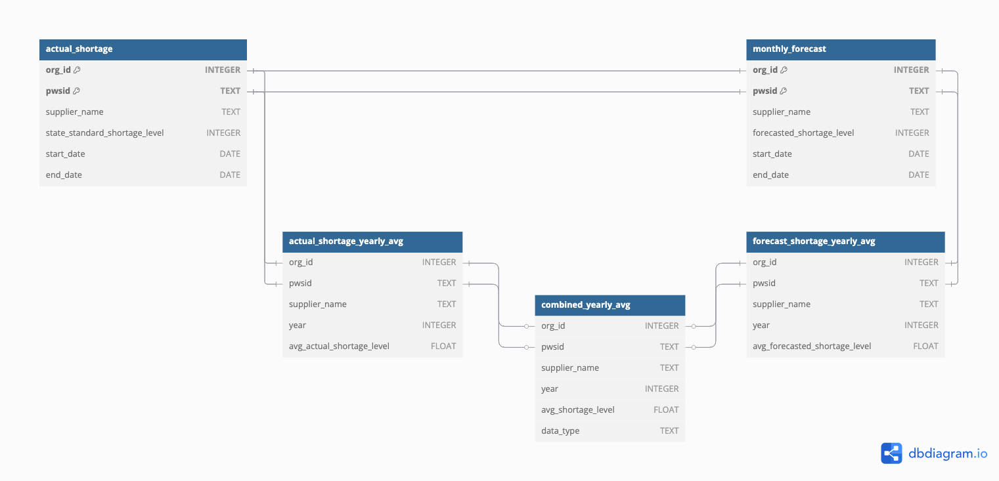

# **California Drought Data Analysis**  
*EDS 213 - Water Shortage Forecast Evaluation*

---

## **Project Overview**

This project explores California's historical and forecasted water shortage data.  

We aim to answer the question:  
**_"How have water shortage levels in California changed over time, and are they reasonably forecasted through time?"_**

Through cleaning, database structuring, SQL querying, and visualization, we look at how water shortage forecasts evolve over time and how well they align with actual reported shortages.



---

## **Project Structure**

```plaintext
├── data/                        # All data files.
│   ├── actual_water_shortage_level.csv
│   ├── monthly_water_shortage_outlook.csv
│   ├── cleaned/                 # Cleaned data for database loading.
│   │   ├── actual_shortage_clean.csv
│   │   └── monthly_outlook_clean.csv
│   └── results/                 # Outputted db results to csv.
│       └── combined_yearly_avg.csv
├── query_viz_files/             # Render files for query_viz.qmd/.html.
├── shortage_db.duckdb           # Final DuckDB database.
├── shortage_db.sql              # SQL script to create and populate database.
├── initial_data_cleaning.R      # R script for data prep/cleaning.
├── query_viz.qmd / .html        # Visualization & report.
└── README.md                    # Your are here!
```

---

## **Key Files Explained**

- `data/`: Contains raw and cleaned datasets.
- `shortage_db.sql`: SQL script to build and populate the database.
- `shortage_db.duckdb`: Final database with all tables.
- `query_viz.qmd`: Final report where we visualize data.
- `initial_data_cleaning.R`: Data cleaning and pre-processing script.

---

## **How to Reproduce This Project**

1. **Run Data Cleaning Script: initial_data_cleaning.R**

Produced cleaned output files for our sql tables.

2. **Set Up the Database:**

```bash
duckdb shortage_db.duckdb < shortage_db.sql
```

3. **Run the Visualization:**
   - Run/Render `query_viz.qmd` to view results and plots.

---

## **Dependencies and Environment**

**Primary Tools Used:**
- DuckDB: v1.2.2  
- R Version: 4.2.3  
- R Packages:
  - DBI 1.1.3  
  - duckdb 1.2.2  
  - ggplot2 3.5.1  
  - dplyr 1.1.4  
  - janitor  
  - readr  
---

## **Full Session Info**

> sessionInfo()
R version 4.2.3 (2023-03-15)
Platform: aarch64-apple-darwin20 (64-bit)
Running under: macOS 15.4.1

Matrix products: default
LAPACK: /Library/Frameworks/R.framework/Versions/4.2-arm64/Resources/lib/libRlapack.dylib

locale:
[1] en_US.UTF-8/en_US.UTF-8/en_US.UTF-8/C/en_US.UTF-8/en_US.UTF-8

attached base packages:
[1] tools     stats     graphics  grDevices utils     datasets  methods   base     

other attached packages:
[1] ggplot2_3.5.1 duckdb_1.2.2  DBI_1.1.3    

loaded via a namespace (and not attached):
 [1] rstudioapi_0.16.0 knitr_1.49        magrittr_2.0.3    tidyselect_1.2.1  munsell_0.5.0     colorspace_2.1-0 
 [7] R6_2.5.1          rlang_1.1.4       fansi_1.0.5       dplyr_1.1.4       grid_4.2.3        gtable_0.3.4     
[13] xfun_0.51         utf8_1.2.3        cli_3.6.3         withr_2.5.1       tibble_3.2.1      lifecycle_1.0.3  
[19] farver_2.1.1      vctrs_0.6.5       glue_1.8.0        evaluate_0.22     labeling_0.4.3    compiler_4.2.3   
[25] pillar_1.9.0      generics_0.1.3    scales_1.3.0      pkgconfig_2.0.3  

---

